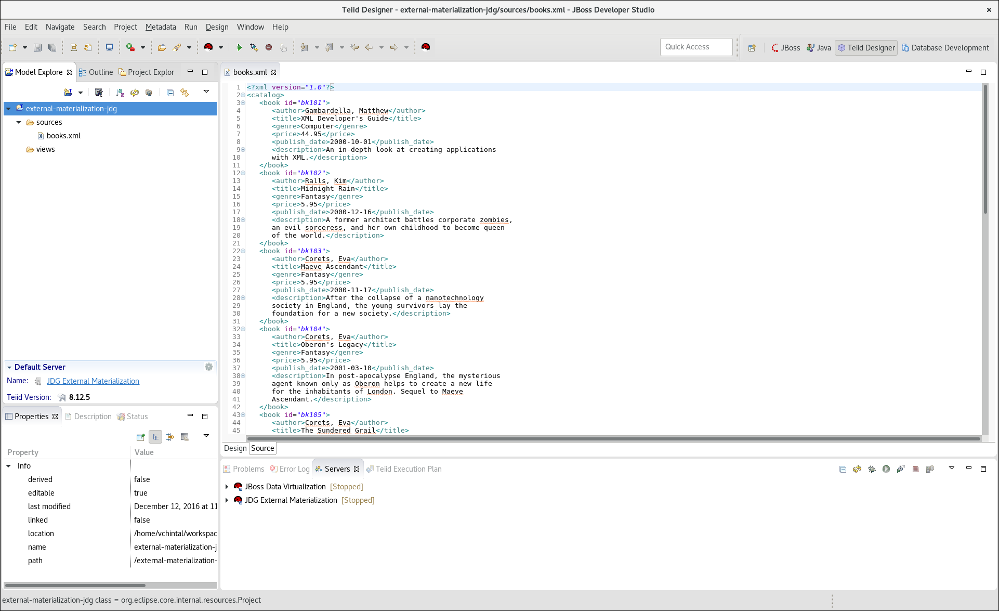
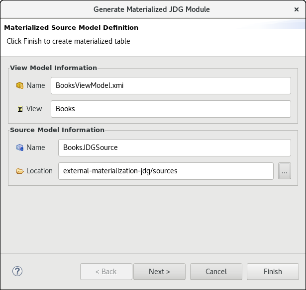
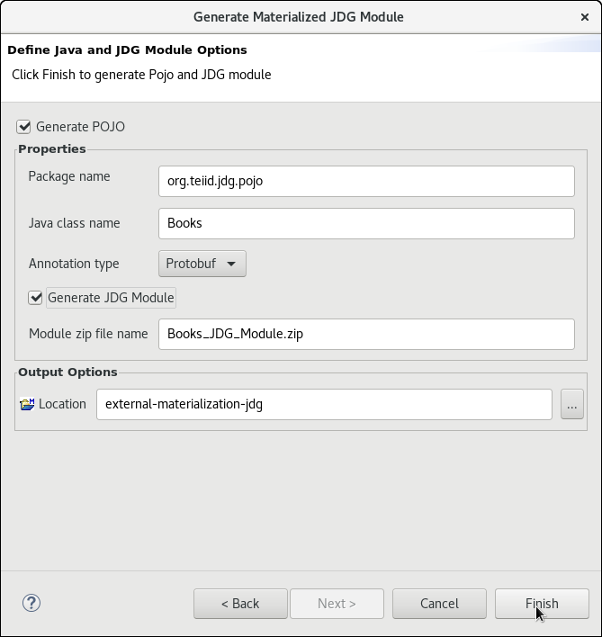
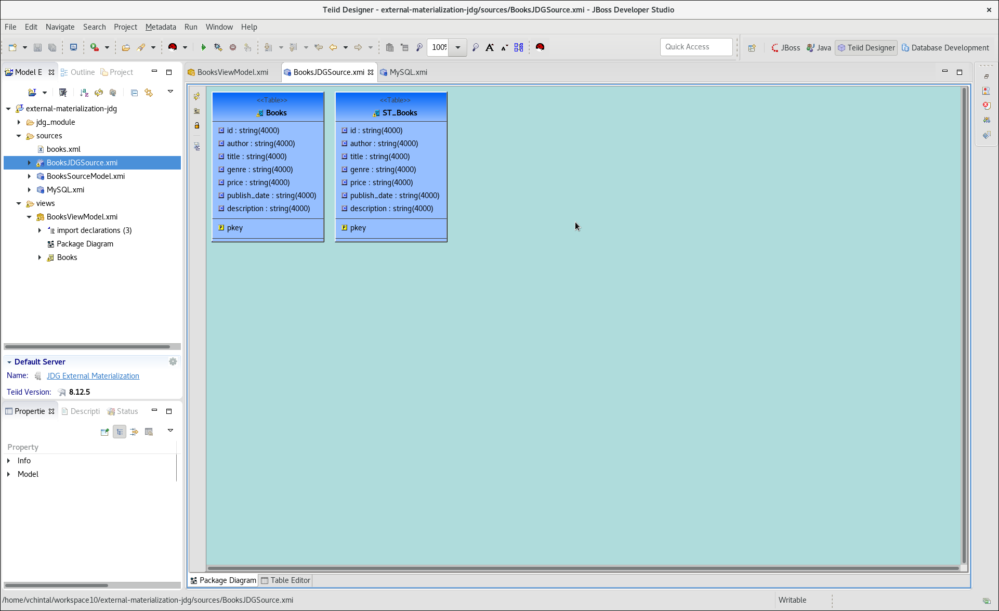
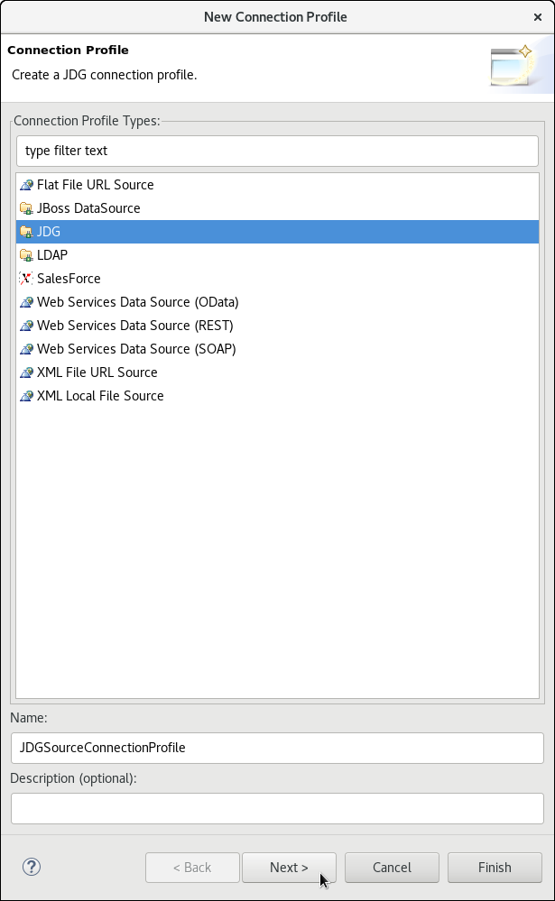
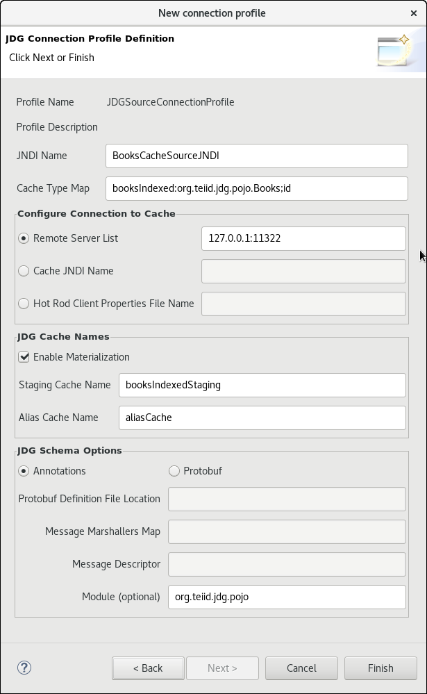
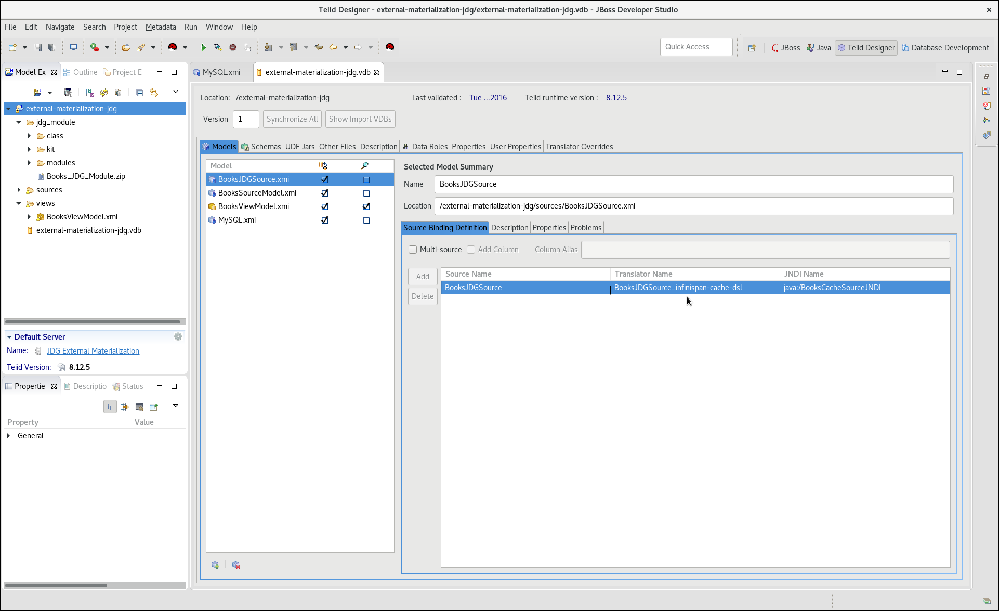
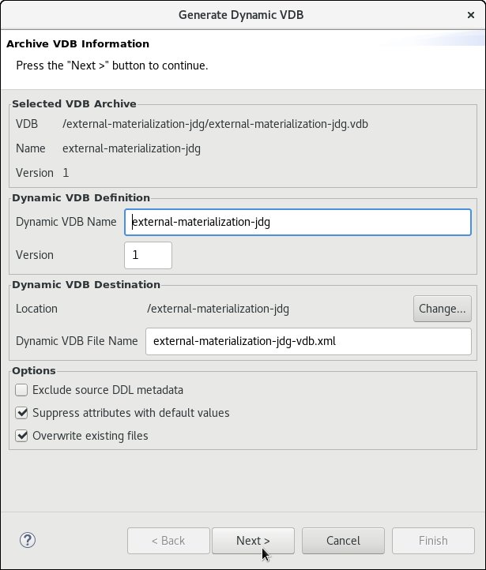
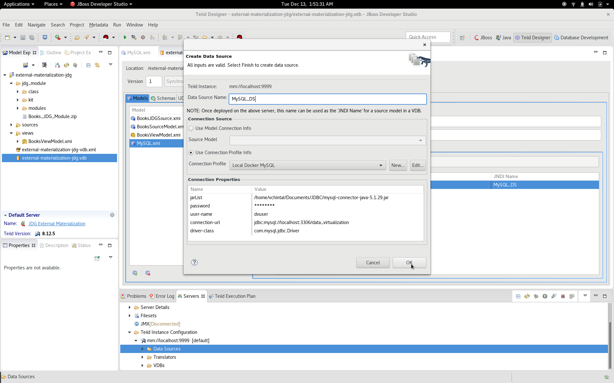

## JDV External Materialization into JDG  

This repo is put together to help automate/speed up bulk of the setup effort in configuring JDG and JDV to demonstrate external materialization.

### Prerequisites

* [Java JDK](http://www.oracle.com/technetwork/java/javase/downloads/jdk8-downloads-2133151.html), preferably 1.8 
* **JAVA_HOME** environment variable set
* **JAVA_HOME\bin** is on the PATH
* All of the necessary binaries downloaded. Refer to [binaries] (binaries/README.md) for download locations and filename/versions.
* Familiarity with Apache Ant

### Running the setup

#### Setup JBoss Data Grid

Use the following two commands to setup and start the JDG server. Going forward we will refer to the folder `target/jdg/jboss-datagrid-6.6.0-server/` as **$JDG_HOME**

```sh
# Kick off JDG setup and wait for it to complete
./install.sh setup-jdg

# Once complete, start the JDG server
./install.sh start-jdg-server
```
#### Setup JBoss Data Virtualization

Use the following command to setup the JDV server. Going forward we will refer to the folder `target/jdv/jboss-eap-6.4/` as **$JDV_HOME**

```sh
./install.sh setup-jdv 
```

#### Important Note
> The password for all accounts on the JDV runtime is `redhat1!`. Refer to **build.properties**.

### Work on JDV Model Project using Teiid Designer

1. Create a new **Teiid Model Project** using **Teiid Perspective** in JBoss Developer Studio 9+. Copy the contents of [this XML file](https://msdn.microsoft.com/en-us/library/ms762271(v=vs.85).aspx) as **books.xml** and place in **sources** folder as shown 

   [](.images/1-sample-project.png)

2. Using the **File Source (XML) >> Source and View Model**, generate the source and view models to the XML file as shown. Ideally create a primary key on the view table before proceeding to next step. 

   [](.images/2-books-view-model.png)
3. Right-click on the **Books** view table and choose materialize. Follow the next two images to generate a **BooksJDGSource** with two source tables **Books** and **ST_Books** 

   [](.images/3-materialized-jdg-module.png) 

   [](.images/4-pojo-module.png) 

   [](.images/5-books-jdg-source.png)

4. Bring in a **status** data source table as shown to capture the status of materialization. Follow the [instructions here](https://docs.jboss.org/author/display/TEIID/External+Materialization) to get the DDL for the status table. Note: For MySQL, the `long` types on Cardinality and LoadNumber should be replaced with `bigint`.

   [](.images/6-MySQL.png)

5. On the view table **Books** ensure the shown properties under **Extension** are configured as show: 
   * Allow Teiid Based Management = true
   * Status Table Name = MySQL.status
   * Time To Live (ms) = 60000
   
   [](.images/7-extension-properties.png)

6. Create a new JDG connection profile **JDGSourceConnectionProfile** using the **Database Development** perspective. Right-click on the **Teiid Importer Connections** on the left and then choose **JDG** and proceed as shown and end by clicking on **Finish**.
   * JNDI Name = BooksCacheSourceJNDI
   * Cache Type Map = booksIndexed;org.teiid.jdg.pojo.Books;id
   * Remote Server List = 127.0.0.1:11322
   * Staging Cache Name = booksIndexedStaging
   * Alias Cache Name = aliasCache
   * Module = org.teiid.jdg.pojo

   [](.images/8-jdg-connection-profile.png)

   [](.images/9-jdg-cp-properties.png)

7. Right click on **BooksJDGSource.xmi** and choose **Modeling → Set Connection Profile → Teiid Importer Connections → JDGSourceConnectionProfile**  
8. Create a VDB by right clicking on the project name and choosing **New → Teiid VDB**. Give it the same name as the project and add all the source models and the only view model to the VDB.
9. After the VDB is created 
   * Uncheck the visibility on all the source models as shown
   * Assign **BookJDGSource** a translator override by the name **BooksJDGSource_infinispan-cache-dsl**

   [](.images/10-vdb-jdg-source-translator.png)

10. In the VDB editor, navigate to the tab **User Properties** and add the following properties as shown:
    * lib=org.teiid.jdg.pojo
    * UseConnectorMetadata=cached

    [](.images/11-user-properties.png) 

11. Generate dynamic vdb by right-clicking on the VDB name and selecting **Modeling → Generate Dynamic VDB** as shown. Click **Next** and on the next screen click on **Generate** and conclude by clicking on **Finish** to generate the dynamic vdb XML file.

    [](.images/12-dynamic-vdb.png)

### Deployment

1. Unzip the **Books_JDG_Module.zip** in folder **$JDV_HOME**
2. Update the file **$JDV_HOME/modules/system/layers/dv/org/jboss/teiid/resource-adapter/infinispan/dsl/main/module.xml** and replace the module name **your.pojo.module** with **org.teiid.jdg.module**
3. Start the JDV server by running the command `./install.sh start-jdv-server` from the project root
4. Deploy all the data sources **MySQL**, **BooksJDGSource** and **BooksSourceModel** based on the JNDI they are bound to in the .vdb file (when opened with VDB editor) by navigating to the **Data Sources** under **Teiid Instance Configuration** under the server the Teiid Designer is connected to and right clicking and select **Create Data Source**. Ensure that the data sources are created with the same JNDI as referenced in the dynamic VDB file. 

   [](.images/13-deploy-mysql-ds.png)

>  **Note :** When creating the **BooksJDGSource** resource adapter, you might encounter an error in the designer but the RA definition is already entered into the server configuration file. In which case, stop the server, open the RA definition in the **standalone.xml** file and remove the entire **name** property that is causing the problem and save the file. 

5. Finally, right click on the dynamic VDB file **external-materialization-jdg-vdb.xml** and click on **Modeling → Deploy**.If everything goes well, there are no exceptions in the JDV server log and you can now connect to the dynamic vdb and start querying. The entries end up in the JDG cache by the name **booksIndexed**.
